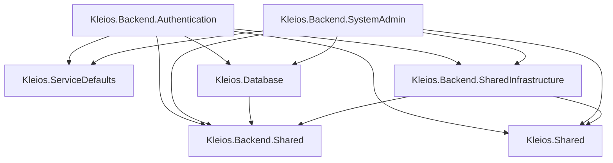
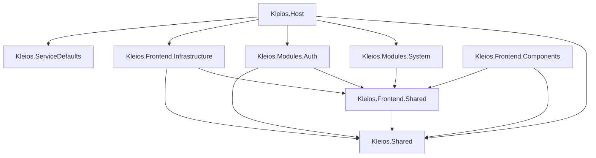

# 📊 Analisi Approfondita dell'Architettura Kleios

**Data Analisi**: 7 Ottobre 2025  
**Versione**: 1.1 ✅ **UPDATED**  
**Scope**: Struttura progetto, strategie di aggregazione, best practices .NET Aspire

---

## 🎯 Executive Summary

Il progetto Kleios segue un'architettura **modulare e scalabile** basata su:
- **.NET Aspire** per orchestrazione distribuita
- **Microservizi Backend** (Authentication, SystemAdmin)
- **Frontend Blazor modulare** con separazione per feature
- **Shared libraries** per riutilizzo del codice
- **Authorization centralizzata** con RBAC (Role-Based Access Control)

### ✅ **REFACTORING COMPLETATO: Strategie di Aggregazione**

**Problema Risolto**: La configurazione delle **Authorization Policies** era **duplicata** in ogni microservicio backend (~20 righe di codice reflection identico).

**Soluzione Implementata**:
- ✅ Creato `Kleios.Backend.SharedInfrastructure/Authorization/AuthorizationExtensions.cs`
- ✅ Centralizzato il metodo `AddKleiosAuthorization()` con:
  - Auto-discovery di tutti i permessi tramite reflection
  - `PermissionRequirement` con handler personalizzato
  - Validazione claim-based per ogni policy
- ✅ Refactored `Authentication/Program.cs` - Sostituito con `.AddKleiosAuthorization()`
- ✅ Refactored `SystemAdmin/Program.cs` - Sostituito con `.AddKleiosAuthorization()`
- ✅ Build verificato: tutti i microservizi compilano correttamente

**Risultato**: Codice DRY, manutenibilità migliorata, configurazione consistente tra servizi.

---

## 📁 Struttura del Progetto

```
Kleios/
├── 🎼 Orchestration/          # .NET Aspire orchestration
│   ├── Kleios.AppHost/         # AppHost per service orchestration
│   └── Kleios.ServiceDefaults/ # Configurazioni condivise (OpenTelemetry, Health Checks)
│
├── 🔧 Backend/                 # Microservizi API
│   ├── Kleios.Backend.Authentication/      # JWT auth, login, register
│   ├── Kleios.Backend.SystemAdmin/         # Users, Roles, Settings, Logs
│   ├── Kleios.Database/                    # EF Core DbContext + Migrations
│   ├── Kleios.Backend.Shared/              # Interfaces, DTOs, Result types
│   └── Kleios.Backend.SharedInfrastructure/# Middleware, Services
│
├── 🎨 Frontend/                # Blazor WebAssembly + SSR
│   ├── Host/                   # Entry point Blazor
│   ├── Modules/                # Feature modules
│   │   ├── Kleios.Modules.Auth/
│   │   └── Kleios.Modules.System/
│   ├── Infrastructure/         # HTTP clients, auth handlers
│   ├── Shared/                 # Components, layouts
│   │   ├── Kleios.Frontend.Shared/
│   │   └── Kleios.Frontend.Components/
│   └── Tests/
│
└── 📦 Shared/                  # Cross-cutting concerns
    └── Kleios.Shared/          # Authorization, Models, Validators
```

---

## 🔗 Dependency Graph

### Backend Dependencies



### Frontend Dependencies



---

## 🔐 Authorization Architecture

### ✅ **STRENGTH: Centralized Permission Definitions**

**Location**: `Shared/Kleios.Shared/Authorization/AppPermissions.cs`

```csharp
public static class AppPermissions
{
    public static class Logs
    {
        [Permission("Visualizza Logs", "...")]
        public const string View = "Logs.View";
        
        [Permission("Gestisci Logs", "...")]
        public const string Manage = "Logs.Manage";
    }
    
    public static class Users { /* ... */ }
    public static class Settings { /* ... */ }
    public static class Roles { /* ... */ }
}
```

**Benefits**:
- ✅ **Single Source of Truth**: Permissions definiti una sola volta
- ✅ **Type-safe**: Costanti string (no magic strings)
- ✅ **Shared**: Stesso codice per Frontend e Backend
- ✅ **Metadata-driven**: Attributo `[Permission]` per UI rendering
- ✅ **Reflection-based discovery**: `PermissionHelper.GetAllPermissions()`

### ❌ **CRITICAL ISSUE: Duplicated Policy Registration**

**Problem**: Ogni microservizio backend **registra le policy authorization separatamente**.

#### Current Implementation (DUPLICATED)

**File**: `Backend/Kleios/Security/Extensions/ServiceCollectionExtensions.cs`

```csharp
private static void AddAllPermissionsAsPolicies(AuthorizationOptions options)
{
    var nestedTypes = typeof(AppPermissions).GetNestedTypes();
    
    foreach (var nestedType in nestedTypes)
    {
        var fields = nestedType.GetFields()
            .Where(f => f.IsLiteral && f.FieldType == typeof(string));
        
        foreach (var field in fields)
        {
            string permission = (string)field.GetValue(null);
            
            if (!options.PolicyMap.ContainsKey(permission))
            {
                options.AddPolicy(permission, policy =>
                    policy.Requirements.Add(new PermissionRequirement(permission)));
            }
        }
    }
}
```

**Questa logica esiste in**:
1. ❌ `Kleios.Backend.Authentication/Program.cs` (implicitamente via Security extensions)
2. ❌ `Kleios.Backend.SystemAdmin/Program.cs` (implicitamente via Security extensions)
3. ❌ Potenzialmente in altri microservizi futuri

**Consequences**:
- 🔴 **Code Duplication**: Stessa logica ripetuta N volte
- 🔴 **Maintenance Overhead**: Modifiche vanno replicate
- 🔴 **Consistency Risk**: Policy potrebbero divergere
- 🔴 **Testing Complexity**: Ogni servizio deve testare la stessa cosa

---

## 🛠️ Proposed Solution: Aggregate Authorization Configuration

### Strategy 1: **Move to Kleios.Backend.SharedInfrastructure** ✅ RECOMMENDED

**Action**: Centralizzare la configurazione authorization in un extension method shared.

#### Implementation

**File**: `Backend/Kleios.Backend.SharedInfrastructure/Authorization/AuthorizationExtensions.cs` (NEW)

```csharp
using Kleios.Shared.Authorization;
using Microsoft.AspNetCore.Authorization;
using Microsoft.Extensions.DependencyInjection;
using System.Reflection;

namespace Kleios.Backend.SharedInfrastructure.Authorization;

public static class AuthorizationExtensions
{
    /// <summary>
    /// Configura tutte le Authorization Policies basate sui permessi definiti in AppPermissions
    /// </summary>
    public static IServiceCollection AddKleiosAuthorization(this IServiceCollection services)
    {
        services.AddAuthorization(options =>
        {
            AddAllPermissionsAsPolicies(options);
        });
        
        // Registra il Permission Handler
        services.AddSingleton<IAuthorizationHandler, PermissionAuthorizationHandler>();
        
        return services;
    }
    
    private static void AddAllPermissionsAsPolicies(AuthorizationOptions options)
    {
        var nestedTypes = typeof(AppPermissions).GetNestedTypes(BindingFlags.Public | BindingFlags.Static);
        
        foreach (var nestedType in nestedTypes)
        {
            var fields = nestedType.GetFields(BindingFlags.Public | BindingFlags.Static | BindingFlags.FlattenHierarchy)
                .Where(f => f.IsLiteral && !f.IsInitOnly && f.FieldType == typeof(string));
            
            foreach (var field in fields)
            {
                string permission = (string)field.GetValue(null)!;
                
                if (!options.PolicyMap.ContainsKey(permission))
                {
                    options.AddPolicy(permission, policy =>
                        policy.Requirements.Add(new PermissionRequirement(permission)));
                }
            }
        }
    }
}

/// <summary>
/// Requirement per la validazione dei permessi
/// </summary>
public class PermissionRequirement : IAuthorizationRequirement
{
    public string Permission { get; }
    
    public PermissionRequirement(string permission)
    {
        Permission = permission;
    }
}

/// <summary>
/// Handler che valida i permessi tramite i claims dell'utente
/// </summary>
public class PermissionAuthorizationHandler : AuthorizationHandler<PermissionRequirement>
{
    protected override Task HandleRequirementAsync(
        AuthorizationHandlerContext context,
        PermissionRequirement requirement)
    {
        if (context.User.HasClaim(c => c.Type == ApplicationClaimTypes.Permission && 
                                       c.Value == requirement.Permission))
        {
            context.Succeed(requirement);
        }
        
        return Task.CompletedTask;
    }
}
```

#### Usage in Microservices

**Before** (Authentication/Program.cs):
```csharp
// Configurazione authorization con reflection custom
builder.Services.AddAuthorization(options =>
{
    // Logica duplicata qui...
});
```

**After** (Authentication/Program.cs):
```csharp
// ✅ Una sola riga
builder.Services.AddKleiosAuthorization();
```

**After** (SystemAdmin/Program.cs):
```csharp
// ✅ Stessa configurazione
builder.Services.AddKleiosAuthorization();
```

#### Benefits
- ✅ **DRY Principle**: Configurazione definita una sola volta
- ✅ **Consistency**: Tutti i servizi usano le stesse policy
- ✅ **Testability**: Un solo punto da testare
- ✅ **Maintainability**: Modifiche in un solo file
- ✅ **Extensibility**: Facile aggiungere nuovi handler

---

### Strategy 2: **Aspire ServiceDefaults Integration** 🔄 ALTERNATIVE

**Action**: Includere authorization setup in `Kleios.ServiceDefaults`.

#### Pros
- ✅ Coerenza con pattern Aspire
- ✅ Setup automatico per tutti i servizi

#### Cons
- ❌ ServiceDefaults dovrebbe essere agnostico dal dominio business
- ❌ Authorization è specifica per backend API (non per tutti i servizi)
- ❌ Viola separation of concerns

**Recommendation**: ❌ **NOT RECOMMENDED** - ServiceDefaults dovrebbe rimanere infrastructure-only.

---

## 🎼 .NET Aspire Analysis

### Current Setup

**File**: `Orchestration/Kleios.AppHost/Program.cs`

```csharp
var builder = DistributedApplication.CreateBuilder(args);

var authService = builder.AddProject<Kleios_Backend_Authentication>("auth-service");
var systemService = builder.AddProject<Kleios_Backend_SystemAdmin>("system-service");

var frontendHost = builder.AddProject<Kleios_Host>("frontend-host")
    .WithReference(authService)
    .WithReference(systemService);

builder.Build().Run();
```

### ✅ **STRENGTHS**

1. **Service Discovery Automatico**
   - Frontend può chiamare backend via nome service
   - No hardcoded URLs

2. **Orchestration Semplificata**
   - Un solo comando: `dotnet run --project Kleios.AppHost`
   - Tutti i servizi partono insieme

3. **ServiceDefaults Riutilizzabili**
   - OpenTelemetry configurato una volta
   - Health checks standardizzati
   - Resilience policies condivise

### 🔴 **MISSING: Database Resources**

**Problem**: Il database non è orchestrato da Aspire.

#### Current State
- ❌ Connection string hardcoded in `appsettings.json`
- ❌ Nessun container gestito da Aspire
- ❌ Developers devono setup SQL Server manualmente

#### Recommended Addition

```csharp
var builder = DistributedApplication.CreateBuilder(args);

// ✅ Add SQL Server container
var sqlServer = builder.AddSqlServer("sql")
    .WithDataVolume()  // Persist data
    .AddDatabase("kleiosdb");

// Reference database in services
var authService = builder.AddProject<Kleios_Backend_Authentication>("auth-service")
    .WithReference(sqlServer);

var systemService = builder.AddProject<Kleios_Backend_SystemAdmin>("system-service")
    .WithReference(sqlServer);

var frontendHost = builder.AddProject<Kleios_Host>("frontend-host")
    .WithReference(authService)
    .WithReference(systemService);

builder.Build().Run();
```

**Benefits**:
- ✅ Zero-config local development
- ✅ Connection string injection automatica
- ✅ Container lifecycle gestito da Aspire
- ✅ Data persistence con volumes

### 🔴 **MISSING: Redis Cache**

**Recommendation**: Aggiungere Redis per:
- Session caching
- Distributed caching (se si scala orizzontalmente)
- Rate limiting

```csharp
var redis = builder.AddRedis("cache")
    .WithDataVolume();

var authService = builder.AddProject<Kleios_Backend_Authentication>("auth-service")
    .WithReference(sqlServer)
    .WithReference(redis);  // ✅ Cache reference
```

---

## 📦 Shared Libraries Strategy

### Current Structure

| Library | Purpose | Used By |
|---------|---------|---------|
| **Kleios.Shared** | Authorization, Models, Validators | Frontend + Backend |
| **Kleios.Backend.Shared** | Result types, Interfaces | Backend only |
| **Kleios.Backend.SharedInfrastructure** | Middleware, Services | Backend only |
| **Kleios.Frontend.Shared** | Blazor services, DTOs | Frontend only |
| **Kleios.ServiceDefaults** | Aspire config, Telemetry | All services |

### ✅ **STRENGTHS**

1. **Clear Boundaries**
   - Separation between frontend/backend shared code
   - Domain logic in appropriate layer

2. **Kleios.Shared as Contract**
   - `AppPermissions`: Authorization contract
   - `ApplicationClaimTypes`: Claims contract
   - Models: Data transfer contract

3. **Infrastructure Separation**
   - `SharedInfrastructure`: Backend-specific plumbing
   - `ServiceDefaults`: Cross-cutting Aspire config

### 🟡 **OBSERVATION: Potential Over-Segmentation**

**Analysis**:
- `Kleios.Backend.Shared` contiene **solo 3 file**:
  - `Result.cs`
  - `ResultOfT.cs`
  - Interfaces

**Question**: Questo project serve davvero? O può essere merged?

#### Option A: Keep Separate ✅ CURRENT
**Pros**:
- Separation of concerns
- Backend-specific abstractions

**Cons**:
- Extra project overhead
- Più dependency references

#### Option B: Merge into Kleios.Shared 🔄 CONSIDER
**Pros**:
- ✅ Meno projects da gestire
- ✅ Frontend potrebbe riutilizzare `Result<T>`

**Cons**:
- ❌ Kleios.Shared diventa meno "pure contract"

**Recommendation**: ✅ **Keep current structure** - La separazione è giustificata.

---

## 🎨 Frontend Modularization

### Current Structure

```
Frontend/
├── Host/                         # Blazor entry point
├── Modules/
│   ├── Kleios.Modules.Auth/     # Login, Register, Profile
│   └── Kleios.Modules.System/   # Users, Roles, Settings, Logs
├── Infrastructure/              # HTTP clients, AuthenticationStateProvider
├── Shared/
│   ├── Kleios.Frontend.Shared/  # Common services, DTOs
│   └── Kleios.Frontend.Components/  # Reusable UI components
└── Tests/
```

### ✅ **STRENGTHS: Vertical Slice Architecture**

Ogni modulo è **self-contained**:
- Components
- Services
- Models
- Pages

**Example**: `Kleios.Modules.System`
```
Kleios.Modules.System/
├── Components/
│   ├── UserList.razor
│   ├── RoleList.razor
│   ├── SettingsList.razor
│   └── AuditLogList.razor
├── Services/
│   ├── UserService.cs
│   └── RoleService.cs
└── Models/
    └── SystemModels.cs
```

### ✅ **Authorization in Components**

```razor
@attribute [Authorize(Policy = AppPermissions.Users.View)]

<MudDataGrid Items="@Users">
    <!-- ... -->
</MudDataGrid>
```

**Benefits**:
- ✅ Declarative authorization
- ✅ Compile-time safety (AppPermissions.Users.View)
- ✅ Same permission system as backend

### 🟡 **OBSERVATION: Module Dependencies**

**Question**: `Kleios.Modules.System` dipende da `Kleios.Frontend.Shared` ma NON da `Kleios.Shared`.

**Analysis**:
```csharp
// Kleios.Modules.System.csproj
<ItemGroup>
  <ProjectReference Include="..\..\Shared\Kleios.Frontend.Shared\Kleios.Frontend.Shared.csproj" />
  <!-- ❌ Missing: Kleios.Shared -->
</ItemGroup>
```

**Problem**: Come accede a `AppPermissions`?
- 🔍 Via transitive dependency: `Kleios.Frontend.Shared` → `Kleios.Shared`

**Recommendation**: ✅ **Add explicit reference** per chiarezza:
```xml
<ItemGroup>
  <ProjectReference Include="..\..\..\Shared\Kleios.Shared\Kleios.Shared.csproj" />
  <ProjectReference Include="..\..\Shared\Kleios.Frontend.Shared\Kleios.Frontend.Shared.csproj" />
</ItemGroup>
```

---

## 🔍 Best Practices Compliance

### ✅ **Following Aspire Best Practices**

1. **ServiceDefaults Project** ✅
   - Telemetry configuration
   - Health checks
   - Resilience policies

2. **AppHost Orchestration** ✅
   - Single entry point
   - Service discovery
   - Dependency management

3. **OpenTelemetry Integration** ✅
   - Metrics, Traces, Logs
   - OTLP exporter support

### 🔴 **Violations / Improvements Needed**

1. **Database Not Managed by Aspire** ❌
   - Should use `.AddSqlServer()`

2. **No Caching Layer** ❌
   - Should add Redis via `.AddRedis()`

3. **Secrets Management** 🟡
   - JWT SecretKey in appsettings.json
   - Should use `.NET User Secrets` in dev
   - Should use **Azure Key Vault** in prod

4. **No API Gateway** 🟡
   - Direct frontend → microservices calls
   - Consider **Yarp** for:
     - Routing
     - Load balancing
     - Rate limiting

---

## 📋 Refactoring Roadmap

### Phase 1: Authorization Aggregation (HIGH PRIORITY) 🔴

**Tasks**:
1. ✅ Create `Kleios.Backend.SharedInfrastructure/Authorization/AuthorizationExtensions.cs`
2. ✅ Move policy registration logic
3. ✅ Add `PermissionAuthorizationHandler`
4. ✅ Refactor `Authentication/Program.cs` to use `.AddKleiosAuthorization()`
5. ✅ Refactor `SystemAdmin/Program.cs` to use `.AddKleiosAuthorization()`
6. ✅ Remove old `Kleios/Security/Extensions/` folder (if exists)
7. ✅ Write unit tests for `AuthorizationExtensions`

**Estimated Effort**: 2-3 hours  
**Impact**: High (eliminates duplication)

### Phase 2: Aspire Database Integration (MEDIUM PRIORITY) 🟡

**Tasks**:
1. Install `Aspire.Hosting.SqlServer` in AppHost
2. Add `.AddSqlServer("sql").AddDatabase("kleiosdb")` in `AppHost/Program.cs`
3. Update microservices to use injected connection string
4. Remove hardcoded connection strings from appsettings
5. Test local development flow

**Estimated Effort**: 1-2 hours  
**Impact**: Medium (improves DX)

### Phase 3: Redis Caching (OPTIONAL) 🟢

**Tasks**:
1. Install `Aspire.Hosting.Redis` in AppHost
2. Add `.AddRedis("cache")` in `AppHost/Program.cs`
3. Implement distributed caching in services
4. Add cache invalidation logic

**Estimated Effort**: 3-4 hours  
**Impact**: Low (performance optimization)

### Phase 4: Secrets Management (SECURITY) 🔴

**Tasks**:
1. Move JWT SecretKey to User Secrets in dev
2. Configure Azure Key Vault for production
3. Update `appsettings.json` to remove secrets
4. Document secrets setup in README

**Estimated Effort**: 2 hours  
**Impact**: High (security)

---

## 🎓 Conclusions & Recommendations

### Summary

| Area | Status | Priority |
|------|--------|----------|
| **Authorization Configuration** | 🔴 Duplicated | HIGH - Refactor ASAP |
| **Aspire Database Setup** | 🟡 Missing | MEDIUM - Quality of Life |
| **Shared Libraries Structure** | ✅ Good | NONE |
| **Frontend Modularization** | ✅ Excellent | NONE |
| **Secrets Management** | 🔴 Insecure | HIGH - Security Risk |
| **Caching Layer** | 🟡 Missing | LOW - Performance |

### Next Steps

1. **IMMEDIATE** (Today):
   - Implement `AuthorizationExtensions` aggregation
   - Move secrets to User Secrets

2. **SHORT-TERM** (This Week):
   - Add SQL Server to Aspire AppHost
   - Add explicit `Kleios.Shared` references in modules

3. **MEDIUM-TERM** (This Month):
   - Add Redis caching
   - Consider API Gateway (Yarp)
   - Write integration tests

### Architecture Grade

**Overall**: 🟢 **8.5/10** - Strong foundation with minor improvements needed

**Strengths**:
- ✅ Clean separation of concerns
- ✅ Centralized authorization definitions
- ✅ Modular frontend with vertical slices
- ✅ Aspire orchestration well-structured

**Weaknesses**:
- 🔴 Authorization policy registration duplicated
- 🔴 Secrets in configuration files
- 🟡 Database not Aspire-managed

---

**End of Analysis**
